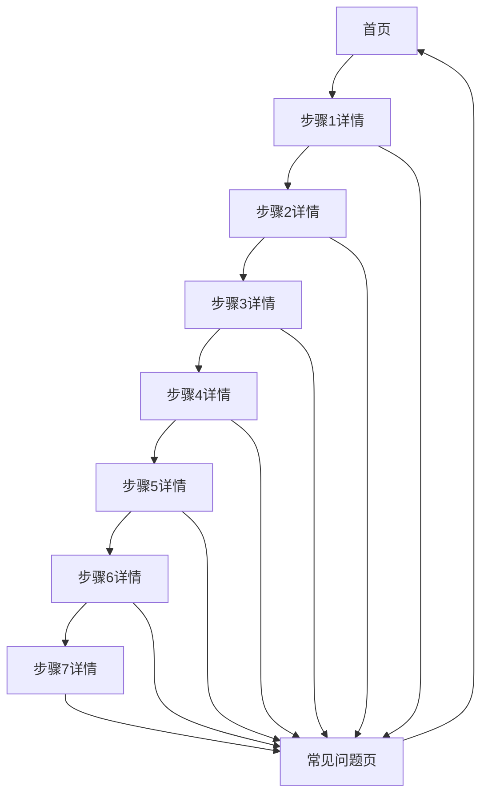

## 1. Product Overview
超市补货流程指南是一个专为轻度心智障碍者设计的web应用，帮助他们学习和执行超市补货任务。
- 提供简单直观的单步流程指南，包含语音播报功能
- 目标用户为轻度心智障碍者，通过视觉和听觉双重提示提高学习效果

## 2. Core Features

### 2.1 User Roles
| Role | Registration Method | Core Permissions |
|------|---------------------|------------------|
| 理货员 | 无需注册 | 访问所有功能，使用补货流程指南 |
| 培训师 | 无需注册 | 访问所有功能，查看常见问题 |

### 2.2 Feature Module
1. **首页**：流程指南入口，步骤导航
2. **步骤详情页**：单步流程详解，语音播报
3. **常见问题页**：问题解答，帮助中心

### 2.3 Page Details
| Page Name | Module Name | Feature description |
|-----------|-------------|---------------------|
| 首页 | 流程导航 | 显示7个补货步骤的概览，点击进入详情 |
| 步骤详情页 | 步骤内容 | 大字体显示步骤说明，语音播报按钮，上一步/下一步导航 |
| 步骤详情页 | 语音播报 | 点击播放按钮，朗读当前步骤的语音提示 |
| 常见问题页 | 问题列表 | 显示10个常见问题及答案，点击展开查看详情 |

## 3. Core Process
用户打开应用后，首先看到7个补货步骤的概览。点击任意步骤进入详情页，查看详细说明并可播放语音提示。通过上一步/下一步按钮在步骤间导航。在常见问题页查看可能遇到的问题及解决方案。

## 4. User Interface Design
### 4.1 Design Style
- 主色调：蓝色 #4A90E2，辅助色：橙色 #FF9500
- 按钮样式：大圆角，3D效果，易于点击
- 字体：无衬线字体，大字号，粗体
- 布局风格：卡片式布局，简洁明了
- 图标风格：扁平化，大尺寸，色彩鲜明

### 4.2 Page Design Overview
| Page Name | Module Name | UI Elements |
|-----------|-------------|-------------|
| 首页 | 流程导航 | 7个大卡片，每个卡片显示步骤编号和标题，点击进入详情，卡片使用不同颜色区分 |
| 步骤详情页 | 步骤内容 | 大字体标题，简洁明了的步骤说明，语音播放按钮，上一步/下一步按钮 |
| 常见问题页 | 问题列表 | 10个可展开的问题卡片，点击展开查看答案，使用图标辅助理解 |

### 4.3 Responsiveness
- 桌面端优先设计
- 支持平板和手机端自适应
- 针对触摸屏优化，按钮尺寸大，易于点击
- 字体大小在不同设备上保持清晰可读

### 4.4 3D Scene Guidance
- 无3D场景需求