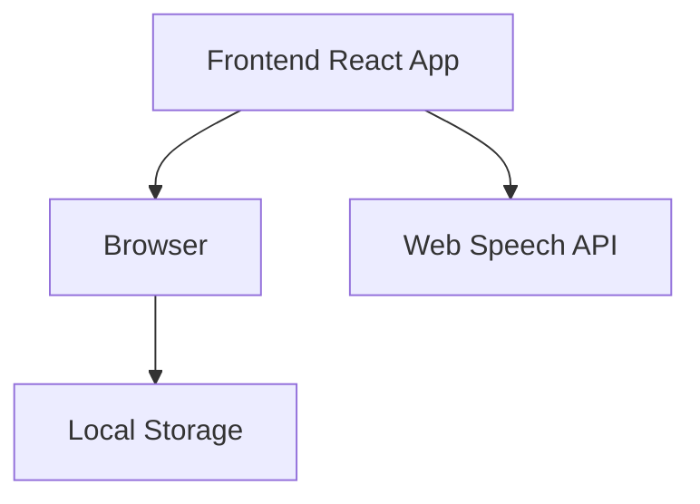

## 1. Architecture Design

## 2. Technology Description
- Frontend: React@18 + tailwindcss@3 + vite
- Initialization Tool: vite-init
- Backend: None (纯前端应用)
- Database: Local Storage (存储用户偏好设置)

## 3. Route Definitions
| Route | Purpose |
|-------|---------|
| / | 首页 - 流程导航 |
| /step/:id | 步骤详情页 - 显示单个步骤的详细信息 |
| /faq | 常见问题页 - 显示常见问题及答案 |

## 4. API Definitions
- 无后端API需求
- 使用Web Speech API进行语音播报

## 5. Server Architecture Diagram
- 无后端服务

## 6. Data Model
### 6.1 Data Model Definition
- 无数据库需求，使用硬编码数据

### 6.2 Data Definition Language
- 无数据库表结构需求

## 7. 技术特点
- 纯前端实现，无需后端服务
- 使用Web Speech API实现语音播报功能
- 响应式设计，支持多种设备
- 大字体、简洁界面，适合轻度心智障碍者使用
- 本地存储用户偏好设置（如语音速度、音量等）